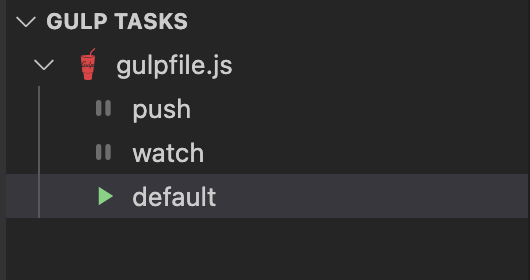

# Setup Environment
```javascript
npm install -g gulp gulp-exec
npm install -g clasp
clasp login
```

## Start gulp
```javascript
gulp
```

or click start gulp task on left-hand menu



## To push code
```bash
clasp push
```

## To execute function
```bash
clasp run [function name]
```
## To fix issue push file ineffective
Re-check rootDir on file .clasp.json. It should be mapped with working directory

## generate js files
npx tsc