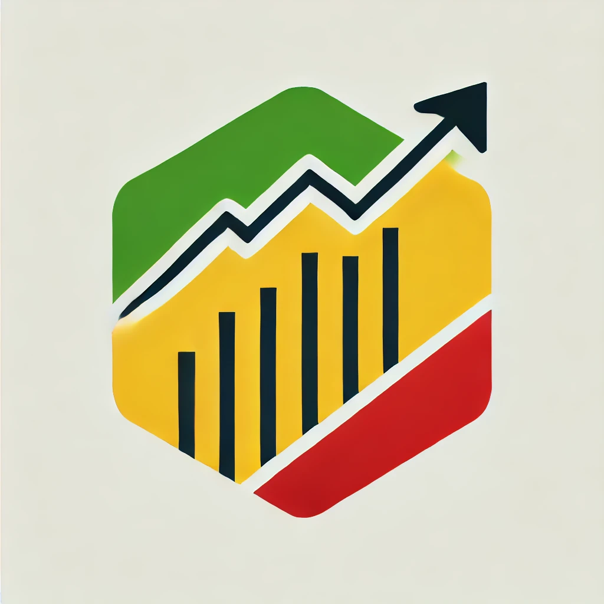

<!-- Improved compatibility of back to top link: See: https://github.com/othneildrew/Best-README-Template/pull/73 -->
<a name="readme-top"></a>
<!--
*** Thanks for checking out the Best-README-Template. If you have a suggestion
*** that would make this better, please fork the repo and create a pull request
*** or simply open an issue with the tag "enhancement".
*** Don't forget to give the project a star!
*** Thanks again! Now go create something AMAZING! :D
-->


<!-- PROJECT SHIELDS -->
<!--
*** I'm using markdown "reference style" links for readability.
*** Reference links are enclosed in brackets [ ] instead of parentheses ( ).
*** See the bottom of this document for the declaration of the reference variables
*** for contributors-url, forks-url, etc. This is an optional, concise syntax you may use.
*** https://www.markdownguide.org/basic-syntax/#reference-style-links
-->
[![LinkedIn][linkedin-shield]][linkedin-url]
[![GitHub Badge][GitHub Badge]][GitHub-url]
[![facebook][facebook]][facebook-url]


<!-- PROJECT LOGO -->
<br />
<div align="center">
  <a href="https://github.com/othneildrew/Best-README-Template">
    
  </a>

  <h3 align="center">VNI on Google Sheet</h3>

  <p align="center">
    Tải các thông tin liên quan đến chỉ số chứng khoán Việt Nam VN-INDEX từ đó đưa ra phân tích, dự đoán và quyết định đầu tư.
    <br />
  </p>
</div>


<!-- ABOUT THE PROJECT -->
## 1. THÔNG TIN DỰ ÁN

Đây là dự án cá nhân của tôi, mục đích trước tiên là tìm ra những phương pháp đầu tư cổ phiếu để thu được lợi nhuận cao và giảm công sức của nhà đầu tư (NDT) phải bỏ ra.
Mở rộng hơn, định hướng phát triển của dự án là áp dụng những công nghệ mới nhất, như AI, ML, Data analys,... vào việc phân tích, dự đoán các xu hướng, sự kiện có thể xảy ra trong tương lai trên thị trường.


### KỸ THUẬT

Dưới dây là các công nghệ hiện có trong dự án.

[![typescript][typescript]][ts-url]
[![node][node]][node-url]
[![gas][gas]][gas-url]


<!-- GETTING STARTED -->
## 2. CÀI ĐẶT BAN ĐẦU

Đây là một ví dụ về cách bạn có thể đưa ra hướng dẫn để thiết lập dự án của mình một cách cục bộ.
Để có một bản sao cục bộ hoạt động, hãy làm theo những bước ví dụ đơn giản sau.

### CHUẨN BỊ

Cài đặt các gói thư viện nodejs, thông tin thư viện đã được liệt kê sẵn trong file package.json
* npm
  ```sh
  npm i
  ```

### CÀI ĐẶT

Thực hiện các bước sau đây để cài đặt ứng dụng

1. Clone the repo
   ```sh
   git clone git@github.com:hontrang/google-sheet.git
   ```
2. Install NPM packages
   ```sh
   npm install
   ```

<p align="right">(<a href="#readme-top">back to top</a>)</p>


<!-- USAGE EXAMPLES -->
## 3. SỬ DỤNG

1. Build Dashboard
  ```sh
   npm run build:main
   ```

2. Build Data warehouse
  ```sh
   npm run build:dw
   ```
3. Deploy dự án lên Google Apps Script (gas)
  ```sh
   npm run deploy
   ```
3. Test
  ```sh
   npm run test
   ```


<p align="right">(<a href="#readme-top">back to top</a>)</p>

<!-- MARKDOWN LINKS & IMAGES -->
<!-- https://www.markdownguide.org/basic-syntax/#reference-style-links -->
[linkedin-shield]: https://img.shields.io/badge/LinkedIn-0A66C2?logo=linkedin&logoColor=fff&style=flat-square
[linkedin-url]: https://www.linkedin.com/in/hontrang/
[GitHub Badge]: https://img.shields.io/badge/GitHub-181717?logo=github&logoColor=fff&style=flat-square
[GitHub-url]: https://github.com/hontrang
[facebook]: https://img.shields.io/badge/Facebook-0866FF?logo=facebook&logoColor=fff&style=flat-square
[facebook-url]: https://www.facebook.com/hhontrang


[product-screenshot]: images/screenshot.png
[typescript]: https://shields.io/badge/TypeScript-3178C6?logo=TypeScript&logoColor=FFF&style=flat-square
[ts-url]: https://www.typescriptlang.org
[gas]: https://img.shields.io/badge/Google%20Apps%20Script-4285F4?logo=googleappsscript&logoColor=fff&style=flat
[gas-url]: https://www.google.com/script/start/
[node]: https://img.shields.io/badge/Node.js-393?logo=nodedotjs&logoColor=fff&style=flat
[node-url]: https://nodejs.org/en
