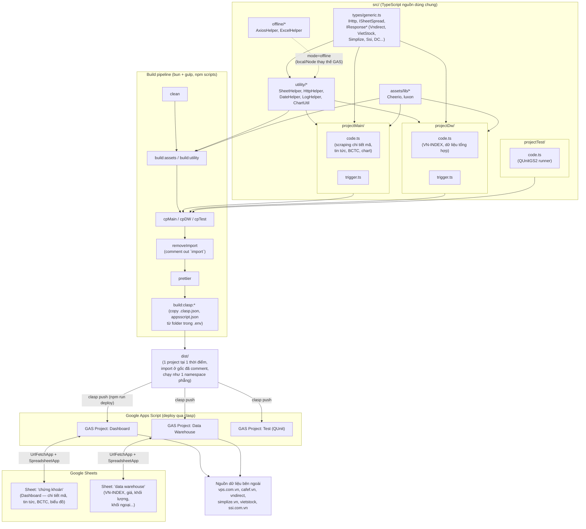
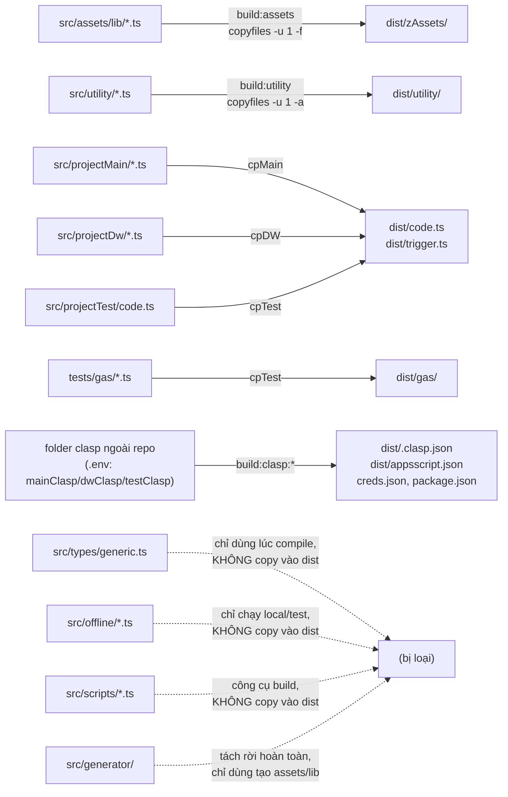
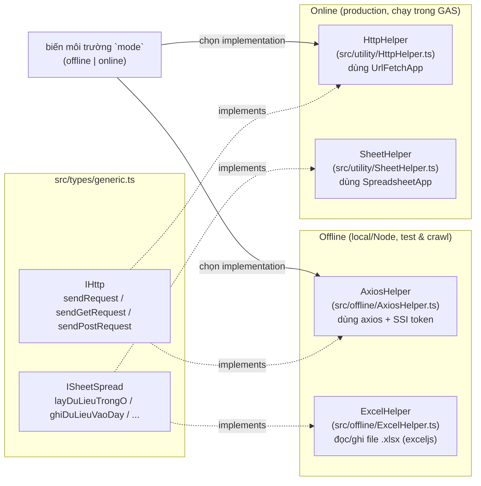
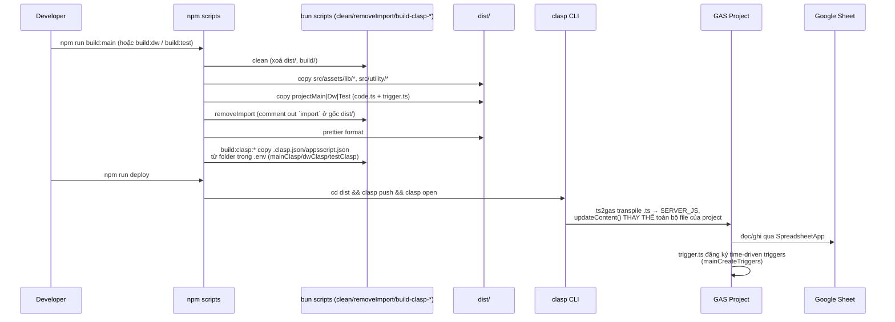
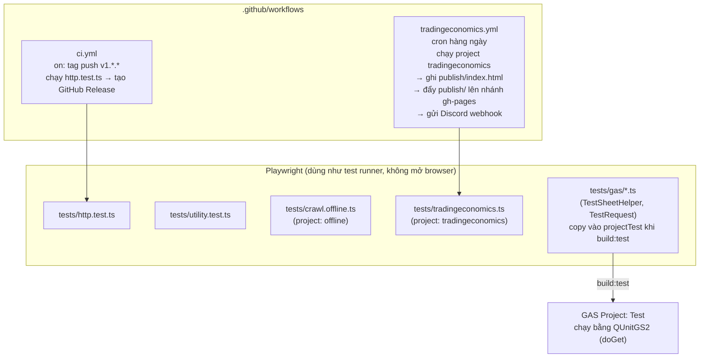

# Kiến trúc dự án

Dự án là một bộ TypeScript dùng chung, được biên dịch/đóng gói thành 3 project **Google Apps Script (GAS)** riêng biệt, mỗi project gắn với một Google Sheet phục vụ phân tích thị trường chứng khoán Việt Nam (VN-INDEX).

## 1. Tổng quan các thành phần



## 2. Cấu trúc thư mục

### 2.1. Cây thư mục nguồn

```text
google-sheet/
├── src/
│   ├── assets/
│   │   ├── lib/                   # thư viện JS đã đóng gói lại thành .ts để chạy được trong GAS
│   │   │   ├── Cheerio.ts         # ~15.8k dòng — bundle cheerio (parse HTML)
│   │   │   └── luxon.ts           # ~7.7k dòng — bundle luxon (xử lý ngày giờ)
│   │   ├── gulp.png
│   │   └── logo.jpg
│   ├── utility/                   # helper dùng chung cho cả 3 project (bản ONLINE, chạy trong GAS)
│   │   ├── SheetHelper.ts         # class SheetHelper implements ISheetSpread + hằng số `sheetName`
│   │   ├── HttpHelper.ts          # class HttpHelper implements IHttp (UrlFetchApp)
│   │   ├── DateHelper.ts          # class DateHelper (bọc luxon)
│   │   ├── LogHelper.ts           # class LogHelper — ghi log ra tab `debug` + đóng dấu thời gian
│   │   └── ChartUtil.ts           # class ChartHelper — vẽ/cập nhật biểu đồ trong sheet
│   ├── types/
│   │   └── generic.ts             # IHttp, ISheetSpread, IResponse* (Vndirect, VietStock, Simplize, Ssi, DC…)
│   ├── offline/                   # bản thay thế chạy local/Node khi `mode=offline`
│   │   ├── AxiosHelper.ts         # IHttp bằng axios + token SSI
│   │   └── ExcelHelper.ts         # ISheetSpread đọc/ghi file .xlsx (exceljs)
│   ├── projectMain/               # → GAS "Dashboard"        (npm run build:main)
│   │   ├── code.ts                # scraping chi tiết mã, tin tức, BCTC, cổ tức, chart
│   │   └── trigger.ts             # mainCreateTriggers / mainDeleteTrigger
│   ├── projectDw/                 # → GAS "Data Warehouse"   (npm run build:dw)
│   │   ├── code.ts                # VN-INDEX + chỉ số thị trường tổng hợp
│   │   └── trigger.ts
│   ├── projectTest/               # → GAS "Test"             (npm run build:test)
│   │   └── code.ts                # runner QUnitGS2 (doGet), khai báo mảng TESTS_ — KHÔNG có trigger.ts
│   ├── scripts/                   # script build, chạy bằng bun
│   │   ├── clean.ts               # xoá dist/* và build/*
│   │   ├── remove-import.ts       # gulp + regex comment-out `import`
│   │   ├── build-clasp-main.ts    # copy metadata clasp từ folder trong .env ($mainClasp)
│   │   ├── build-clasp-dw.ts      # ($dwClasp)
│   │   └── build-clasp-test.ts    # ($testClasp)
│   └── generator/                 # tiện ích ĐỘC LẬP — không nằm trong pipeline build 3 project
│       ├── Main.js                # gán thư viện npm vào `global` rồi webpack + gas-webpack-plugin → Code.gs
│       ├── webpack.config.js
│       ├── package.json           # có node_modules riêng
│       └── README.md              # hướng dẫn tạo ra chính các file trong src/assets/lib/
├── tests/
│   ├── http.test.ts               # Playwright project "test" — cũng là test chạy trong ci.yml
│   ├── utility.test.ts            # Playwright project "test"
│   ├── crawl.offline.ts           # Playwright project "offline"
│   ├── tradingeconomics.ts        # Playwright project "tradingeconomics" (cron CI)
│   └── gas/                       # test chạy BÊN TRONG GAS, được `cpTest` copy vào dist/ khi build:test
│       ├── TestSheetHelper.ts
│       └── TestRequest.ts
├── publish/                       # OUTPUT sinh tự động, publish lên GitHub Pages (tradingeconomics.yml)
│   ├── index.html                 # bản scrape tradingeconomics.com/calendar, bị ghi đè mỗi lần chạy
│   └── nocode.txt
├── .github/workflows/
│   ├── ci.yml
│   └── tradingeconomics.yml
├── dist/                          # (gitignore) kết quả build — xem 2.2
├── .env                           # (gitignore) mainClasp / dwClasp / testClasp + credential SSI
├── tsconfig.json                  # path alias @utils/* → src/utility/*, @src/* → src/*
├── eslint.config.js
├── playwright.config.ts
├── .prettierrc
├── CLAUDE.md
├── architecture.md
└── README.md
```

### 2.2. `dist/` sau khi build

`dist/` là **thư mục làm việc của clasp** — nó vừa chứa source đã xử lý, vừa chứa toàn bộ metadata/credential để `clasp push` biết đẩy lên GAS project nào và với danh nghĩa tài khoản nào.

`dist/` **không phẳng hoàn toàn**: chỉ `code.ts` / `trigger.ts` nằm ở gốc, còn utility và assets vẫn giữ thư mục con (`copyfiles -a` cho utility, `-f` + đích `dist/zAssets` cho assets). Ví dụ sau `npm run build:main`:

```text
dist/
├── code.ts                # từ src/projectMain/code.ts     — import đã bị comment
├── trigger.ts             # từ src/projectMain/trigger.ts  — import đã bị comment
├── utility/               # từ src/utility/*.ts  (copyfiles -a nên giữ nguyên folder)
│   ├── ChartUtil.ts
│   ├── DateHelper.ts
│   ├── HttpHelper.ts
│   ├── LogHelper.ts
│   └── SheetHelper.ts
├── zAssets/               # từ src/assets/lib/*.ts (copyfiles -f nên bị làm phẳng)
│   ├── Cheerio.ts
│   └── luxon.ts
│
│   # ── 6 file dưới đây copy nguyên si từ folder clasp ngoài repo (build:clasp:*) ──
├── appsscript.json        # MANIFEST — file DUY NHẤT không phải .ts được đẩy lên GAS
├── .clasp.json            # scriptId (+ parentId) → quyết định push vào GAS project nào
├── .claspignore           # pattern loại file khỏi lần push
├── .clasprc.json          # (chỉ folder main) OAuth token cục bộ, quyền 600
├── creds.json             # (chỉ folder main) OAuth client dùng cho `clasp login --creds`
└── package.json           # nội dung `{}` — bắt buộc phải có, xem 2.4
```

Khi `build:test`, `cpTest` copy thêm `tests/gas/*.ts` (giữ folder `gas/`) vào `dist/gas/`.

**Mỗi build ghi đè `dist/`** (`clean` xoá `dist/*` trước), nên `dist/` luôn chỉ ứng với đúng 1 project. Nhưng lưu ý `clean` dùng `sh.rm('-rf', 'dist/*')` mà glob `*` của shelljs **không khớp dotfile**, nên `.clasprc.json`, `.DS_Store`… sống sót qua mọi lần build. Hậu quả thực tế: build `main` (folder clasp của nó có `.clasprc.json`) rồi build `test` (folder clasp không có file đó) thì token OAuth của **main** vẫn nằm lại trong `dist/` và được dùng để xác thực cho lần push `test`. Muốn sạch hẳn phải dùng `dist/{*,.*}` hoặc `sh.rm('-rf', destPath)` rồi tạo lại thư mục. Đây là lý do `npm run deploy` chạy riêng lẻ rất dễ đẩy nhầm: nó push nội dung `dist/` **hiện tại**, không quan tâm bạn đang định deploy project nào. Dùng `build:main:deploy` / `build:dw:deploy` / `build:test:deploy` để build và push liền mạch.

### 2.3. Ánh xạ thư mục nguồn → dist



Bốn thư mục `types/`, `offline/`, `scripts/` và `generator/` **không bao giờ được deploy** — chúng chỉ tồn tại ở source. Vì `types/generic.ts` không lên GAS nên các interface (`IHttp`, `ISheetSpread`, `IResponse*`) chỉ có tác dụng lúc type-check, đúng như bản chất type-only của TypeScript.

### 2.4. `dist/` được đẩy lên Google Apps Script như thế nào

```sh
npm run deploy   # = cd dist && clasp push && clasp open
```

Toàn bộ lệnh chạy với **cwd = `dist/`**. Đây là điểm mấu chốt: clasp coi `dist/` là project root, nên nó đọc `.clasp.json`, `.claspignore`, `appsscript.json`, `.clasprc.json` ngay trong `dist/` — không phải ở gốc repo.

#### a) File nào được đẩy, file nào bị bỏ

Kiểm chứng bằng `cd dist && clasp status` (đọc thuần, không gọi mạng):

| Được đẩy lên GAS | Bị bỏ qua |
| --- | --- |
| `appsscript.json` | `.clasp.json` |
| `code.ts` | `.claspignore` |
| `trigger.ts` | `.clasprc.json` |
| `utility/*.ts` (5 file) | `creds.json` |
| `zAssets/*.ts` (2 file) | `package.json` |
| | `.DS_Store` |

clasp chỉ nhận file có type hợp lệ với GAS: `.ts`/`.js`/`.gs` → `SERVER_JS`, `.html` → `HTML`, và **duy nhất** `appsscript.json` → `JSON` (manifest). Mọi `.json` khác bị loại tự động, nên `creds.json` / `package.json` an toàn nằm trong `dist/` mà không bị đẩy lên. `.claspignore` (nội dung `**/gulpfile.js` cho main, `gulpfile.js` cho dw, rỗng cho test) hiện gần như không loại thêm gì.

#### b) Thư mục con thành tên file có dấu `/`

GAS không có thư mục thật. clasp giữ đường dẫn tương đối làm **tên file**, nên cây `dist/` ở trên hiện trong GAS editor thành:

```text
code.gs
trigger.gs
utility/ChartUtil.gs
utility/DateHelper.gs
utility/HttpHelper.gs
utility/LogHelper.gs
utility/SheetHelper.gs
zAssets/Cheerio.gs
zAssets/luxon.gs
appsscript.json
```

GAS editor hiển thị dấu `/` như thư mục ảo, nhưng lúc chạy **tất cả nằm chung một global scope duy nhất** — đó chính là "namespace phẳng" nói ở mục 6. Tiền tố `z` trong `zAssets` khiến 2 bundle khổng lồ (Cheerio ~15.8k dòng, luxon ~7.7k dòng) luôn nằm cuối danh sách file.

Thứ tự file cũng là thứ tự GAS nạp định nghĩa (comment đầu `src/projectTest/code.ts` cảnh báo đúng điều này). Có thể ép thứ tự bằng khoá `filePushOrder` trong `.clasp.json`, nhưng cả 3 folder clasp hiện **không khai báo** khoá này nên clasp dùng thứ tự mặc định: file ở gốc trước, rồi tới các thư mục con theo alphabet.

#### c) clasp tự transpile `.ts` → `.gs` bằng ts2gas

`clasp push` không đẩy TypeScript nguyên bản: mỗi file `.ts` được đưa qua **ts2gas** (đóng gói sẵn trong clasp) rồi upload dưới dạng `SERVER_JS`. Với clasp 2.4.2, ts2gas dùng TypeScript **4.9.5** và mặc định `target: ES3`, `module: None` — clasp chỉ ghi đè bằng `tsconfig.json` nằm **trong project root**, mà `dist/` không có file này, nên `tsconfig.json` ở gốc repo (target/alias/strict…) **không ảnh hưởng gì tới bản deploy**; nó chỉ phục vụ IDE, `eslint` và `tsc` lúc dev.

Hệ quả của `target: ES3`: `class` bị hạ cấp thành `var X = (function(){…})()`, `let`/`const` thành `var`, arrow function thành `function`. Ví dụ `utility/HttpHelper.ts` biến thành:

```js
// Compiled using undefined undefined (TypeScript 4.9.5)
var exports = exports || {};
var module = module || { exports: exports };
exports.HttpHelper = void 0;
//import { IHttp } from '@src/types/generic';
var HttpHelper = /** @class */ (function () {
    function HttpHelper() { }
    HttpHelper.prototype.sendRequest = function (url) { return url; };
    return HttpHelper;
}());
exports.HttpHelper = HttpHelper;
```

Ba điều quan trọng đọc được từ đây:

1. **ts2gas tự comment-out `import`** (dòng `//import { IHttp } …`). Bước `removeImport` trong pipeline vì thế là lớp bảo hiểm thứ hai, không phải điều kiện bắt buộc để deploy chạy.
2. Class trở thành `var` ở top-level → được hoist thành **biến global**, đó là cơ chế thật khiến `SheetHelper`, `HttpHelper`… gọi được từ `code.gs` dù không có `import` nào.
3. ts2gas chèn shim `var exports/module` nên `export` không gây lỗi; interface trong `src/types/generic.ts` bị TypeScript xoá hoàn toàn lúc emit, đúng như đã nói ở 2.3.

> ⚠️ **Lưu ý về `removeImport`**: `src/scripts/remove-import.ts` dùng glob `dist/*.ts` — chỉ khớp file ở **gốc** `dist/`. Nên `dist/utility/*.ts` (và `dist/gas/*.ts` khi build:test) vẫn còn nguyên `import`, ví dụ `dist/utility/HttpHelper.ts` giữ dòng `import { IHttp } from '@src/types/generic';`. Deploy vẫn chạy bình thường vì ts2gas comment giúp ở bước push (xem b/c). Đây là **điểm lệch so với mô tả "comment mọi import"**, không phải lỗi chặn deploy; muốn xử lý cả thư mục con thì đổi glob thành `dist/**/*.ts`.

#### d) `package.json` rỗng là bắt buộc

`dist/package.json` chỉ chứa `{}` nhưng **không được xoá**: ts2gas đọc `package.json` từ cwd ngay lúc load module. Vì `clasp push` chạy với cwd = `dist/`, thiếu file này thì push chết ngay với `ENOENT: no such file or directory, open 'package.json'`.

#### e) `.clasp.json` quyết định đẩy đi đâu — 3 scriptId khác nhau

`build:clasp:main|dw|test` copy `.clasp.json` từ folder ngoài repo (đường dẫn trong `.env`) vào `dist/`. Đó là toàn bộ cơ chế "chọn project để deploy":

| npm script | Folder nguồn (biến `.env`) | scriptId đích |
| --- | --- | --- |
| `build:clasp:main` | `mainClasp` = `/Users/hontrang/code/clasp/main` | `1LvkaTmx4VMfbQKfry_3KgU6aiQU1M7VaeMWlkp47rOyWbGel2D1GI30a` |
| `build:clasp:dw` | `dwClasp` = `/Users/hontrang/code/clasp/dw` | `1KthkbVsUEKIO0GG5-ytuRrEDdVvCM5Wnx7Ea32R1Iq2A-L9MRWTkSb5u` |
| `build:clasp:test` | `testClasp` = `/Users/hontrang/code/clasp/test` | `1OELQU75xpiO3P2HuY7y_SuL5aCk7GqFfN4Htx2V7JkdJ-mfNpZ2Av42K` |

Vì các folder này **nằm ngoài repo và không được commit**, máy mới clone về sẽ không build được cho tới khi có `.env` + 3 folder đó. `parentId` trong `.clasp.json` của main/dw đều là `1FMPxrstTZMGaxAr3XzKhub-4WRZBD1fxse7TIvNW83Y` — ID này không truy vấn được qua Drive API (xem ghi chú ở mục 7).

#### f) `appsscript.json` khác nhau giữa 3 project

Manifest đi kèm mỗi folder clasp, nên mỗi project deploy lên với cấu hình riêng:

| | main (Dashboard) | dw (Data Warehouse) | test |
| --- | --- | --- | --- |
| `timeZone` | Asia/Ho_Chi_Minh | Asia/Ho_Chi_Minh | Asia/Ho_Chi_Minh |
| `runtimeVersion` | V8 | V8 | V8 |
| `webapp` | *(không có)* | `USER_DEPLOYING` / `ANYONE_ANONYMOUS` | `USER_DEPLOYING` / `MYSELF` |
| `dependencies.libraries` | *(không có)* | *(không có)* | **QUnitGS2** v23 (`1tXPhZmIyYiA_EMpTRJw0QpVGT5Pdb02PpOHCi9A9FFidblOc9CY_VLgG`) |
| `oauthScopes` | scriptapp, spreadsheets(.currentonly), external_request | như main | như main |

`webapp` ở dw và test là bắt buộc vì cả hai đều phục vụ qua `doGet` (test là trang kết quả QUnit). Lưu ý `runtimeVersion: V8` chỉ nói về **runtime**; code upload lên vẫn là ES3 do ts2gas hạ cấp (mục c).

#### g) Xác thực

- Folder `main` có `.clasprc.json` (token OAuth, quyền `600`) + `creds.json` (OAuth client) đi kèm, nên push project này dùng credential **cục bộ trong `dist/`**.
- Folder `dw` và `test` không có 2 file đó → clasp rơi về `~/.clasprc.json` (login toàn cục).
- Cả `.clasprc.json` và `creds.json` đều chứa secret. Chúng nằm ngoài repo và `dist/*` đã bị `.gitignore`, nhưng **tuyệt đối không commit** nếu có thay đổi cấu trúc thư mục.

#### h) Sau `clasp push`

- `clasp open` mở GAS editor của scriptId vừa push.
- Code mới có hiệu lực ngay với lần chạy hàm tiếp theo; **trigger thì không tự tạo** — phải chạy `mainCreateTriggers` trong `trigger.ts` một lần trên GAS (xem mục 4).
- `clasp push` gọi `script.projects.updateContent` với **toàn bộ** danh sách file, tức là **thay thế trọn vẹn** nội dung GAS project: file có trên GAS nhưng không có trong `dist/` sẽ **bị xoá**. Đây là lý do đẩy nhầm `dist/` của project khác sẽ thay sạch code của project đích chứ không phải trộn thêm vào.

## 3. Lớp trừu tượng HTTP & Sheet (online/offline)

`IHttp` và `ISheetSpread` (`src/types/generic.ts`) tách phần I/O khỏi logic nghiệp vụ, cho phép chạy cùng code ở 2 môi trường:



## 4. Luồng build → deploy



## 5. Testing & CI

> Chi tiết riêng về luồng publish (cron, gh-pages, các cạm bẫy đã biết): [docs/publish-workflow.md](docs/publish-workflow.md).



## 6. Ghi chú kiến trúc quan trọng

- **Một namespace phẳng**: GAS không có module system. Bước `removeImport` comment-out các `import` ở gốc `dist/`, và ts2gas comment-out nốt phần còn lại lúc `clasp push` (chi tiết ở mục 2.4) — mọi class/hàm (`SheetHelper`, `HttpHelper`, `DateHelper`, `LogHelper`, `ChartHelper`...) resolve như biến global lúc chạy trên GAS.
- **Chỉ 1 project tồn tại trong `dist/` tại một thời điểm** — build lại sẽ `clean` và ghi đè; `npm run deploy` luôn đẩy đúng nội dung `dist/` hiện tại.
- **`tsconfig.json` ở gốc repo không tham gia vào bản deploy**: clasp chỉ đọc `tsconfig.json` nằm trong project root (`dist/`, không có file này), nên target/strict/path alias chỉ phục vụ IDE + `eslint` + `tsc`. Alias `@utils/* → src/utility/*` và `@src/* → src/*` biến mất khi deploy vì dòng `import` chứa chúng bị comment.
- **3 project chia sẻ cùng utility/types** nhưng có domain riêng biệt:
  - `projectMain` (Dashboard): scraping theo từng mã cổ phiếu — giá, tin tức, báo cáo tài chính, cổ tức, biểu đồ.
  - `projectDw` (Data Warehouse): dữ liệu VN-INDEX và các chỉ số thị trường tổng hợp (PB, PE, room ngoại, khối lượng...).
  - `projectTest`: chạy QUnit bên trong GAS (`QUnitGS2`) để test `SheetHelper`/request trực tiếp trên môi trường GAS thật.
- **Nguồn dữ liệu ngoài**: vps.com.vn, cafef.vn (Cheerio parse HTML), vndirect (`api-finfo.vndirect.com.vn`), simplize.vn, vietstock, ssi.com.vn (qua token SSI trong `AxiosHelper`, chỉ dùng offline).

## 7. Google Sheet thực tế đang liên kết

Đã xác nhận trực tiếp qua Google Drive (2026-09-05), sau khi deploy `projectMain` bằng `npm run build:main:deploy` (script ID `1LvkaTmx4VMfbQKfry_3KgU6aiQU1M7VaeMWlkp47rOyWbGel2D1GI30a`):

| Project GAS | Tên Google Sheet | Sheet ID | Ghi chú |
| --- | --- | --- | --- |
| `projectMain` (Dashboard) | **chứng khoán** | `1GyxkNiyXantim6R6otooAGd6SLoR4J9Db8nCCx216og` | Chứa 1 ô liên kết trực tiếp sang sheet "data warehouse" bên dưới |
| `projectDw` (Data Warehouse) | **data warehouse** | `1yttudZqXZD9URweOzEtkRDda-iUiQEh4a2uNmPlKRfw` | Tab `hose` chứa lịch sử VN-INDEX (ngày, điểm, %, KLGD) |

Lưu ý: `dist/.clasp.json` của `projectMain` (copy từ folder khai báo trong `.env`) ghi `parentId` là `1FMPxrstTZMGaxAr3XzKhub-4WRZBD1fxse7TIvNW83Y` — ID này không truy vấn được qua Drive API (trả về "not found") nên có thể là cấu hình cũ/lệch; ID sheet **chứng khoán** ở trên đã được người dùng xác nhận trực tiếp là sheet đang dùng thật.

**Cách tự kiểm chứng lại mapping này**: chạy hàm `xacDinhSheetDangLienKet()` (có ở cả `src/projectMain/code.ts` và `src/projectDw/code.ts`) trực tiếp trong GAS editor rồi xem Execution log — nó in ra `scriptId`, tên sheet, sheet ID, URL và danh sách tab của container mà script đang bound vào, trả về `null` nếu script là standalone. Đây là cách chính xác nhất vì code **không hardcode sheet ID ở bất kỳ đâu** — mọi I/O đều đi qua `SpreadsheetApp.getActive()` (xem `SheetHelper`, `LogHelper`, `ChartUtil`), nên liên kết nằm hoàn toàn ở chỗ script được bound vào container nào.

Hai cách khác, chỉ để tham khảo:

- Apps Script API `GET https://script.googleapis.com/v1/projects/{scriptId}` trả về field `parentId` = Drive ID của file container. Cần scope `script.projects.readonly`; `.clasprc.json` trong folder `mainClasp` hiện chỉ có scope runtime của script (`spreadsheets`, `spreadsheets.currentonly`, `scriptapp`, `external_request`, `webapp.deploy`) nên phải `clasp login` lại mới gọi được.
- Tra Drive theo `scriptId`: chỉ ra **tên project script** (main → "hose", dw → "data warehouse"), không phải tên container; query file con của sheet cũng không thấy script vì bound script bị ẩn khỏi Drive listing.

Các tab trong sheet **chứng khoán** đối chiếu với `SheetHelper.sheetName` (`src/utility/SheetHelper.ts`):

| Hằng số trong code | Giá trị | Tab quan sát được trong sheet |
| --- | --- | --- |
| `sheetThamChieu` | `tham chiếu` | Tham chiếu |
| `sheetBangThongTin` | `bảng thông tin` | Bảng thống kê thông tin đầu tư chứng khoán (NAV, lãi/lỗ, tỷ trọng) |
| `sheetChiTietMa` | `chi tiết mã` | Tra cứu chi tiết 1 mã (nhập tên mã → thông tin công ty) |
| `sheetGia` | `Giá` | Ma trận giá đóng cửa theo mã (cột = hàng trăm mã CK) |
| `sheetKhoiLuong` | `Khối Lượng` | Ma trận khối lượng giao dịch theo mã |
| `sheetKhoiNgoaiMua` | `KN Mua` | Ma trận khối ngoại mua theo mã |
| `sheetKhoiNgoaiBan` | `KN Bán` | Ma trận khối ngoại bán theo mã |
| `sheetHose` | `hose` | Nằm ở sheet **data warehouse**, không phải **chứng khoán** |

Ngoài ra sheet **chứng khoán** còn có các khối dữ liệu chưa map trực tiếp vào `sheetName` (có thể là range/tên sheet khác hoặc đặt tên động): Sự kiện (lịch kinh tế vĩ mô), log Lệnh mua/bán, Cổ phiếu theo nhóm ngành (DCDS), Cổ tức, Biến động tiền mặt, danh sách tin tức, ghi chú "Các bước lựa chọn mã chứng khoán".
