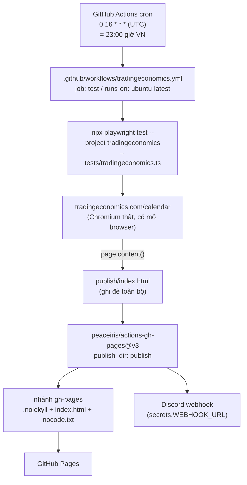

# Workflow của thư mục `publish/`

`publish/` **không phải tài liệu** — nó là thư mục output được sinh tự động và đem publish lên GitHub Pages. Thư mục `docs/` (chứa chính file này) mới là nơi lưu tài liệu.

> Trước đây thư mục này tên là `docs/`, gây hiểu nhầm là tài liệu. Đã đổi thành `publish/` cho sát nghĩa.

## 1. Toàn cảnh



## 2. Các bước trong workflow

| # | Step | Ghi chú |
| --- | --- | --- |
| 1 | `actions/checkout@v4` | `ref: ${{ github.event.pull_request.head.ref }}` — với sự kiện `schedule` thì `pull_request` là null nên ref rỗng, git checkout mặc định về nhánh chính. Đây là dòng thừa còn sót lại. |
| 2 | `actions/setup-node@v4` | `node-version: lts/*` |
| 3 | `npm ci` | |
| 4 | `npx playwright install --with-deps` | Cần browser thật vì đây là scrape có JS |
| 5 | `npx playwright test --project tradingeconomics` | Sinh ra `publish/index.html` |
| 6 | `ls -la /home/runner/work/google-sheet/google-sheet/` | Step debug, đường dẫn hardcode, có thể xoá |
| 7 | `peaceiris/actions-gh-pages@v3` | `publish_dir: publish`, đẩy lên nhánh `gh-pages` |
| 8 | `tsickert/discord-webhook@v7.0.0` | Báo thành công |

Phần gửi Telegram đã bị comment lại ở cuối file workflow.

## 3. Bước scrape làm gì

[`tests/tradingeconomics.ts`](../tests/tradingeconomics.ts) chạy như một Playwright test nhưng thực chất là script crawl:

1. Mở `https://tradingeconomics.com/calendar` bằng Chromium headless (user-agent Windows/Chrome giả).
2. Bấm **Countries** → **Clear** → chọn **United States** → **Save** để lọc chỉ còn lịch kinh tế Mỹ.
3. Cuộn trang tối đa **50 lần** (mỗi lần 1000px, chờ 500ms), dừng sớm khi `div.card-header` hiện ra.
4. Lấy `page.content()` và **ghi đè** `publish/index.html`.

Project `tradingeconomics` trong [`playwright.config.ts`](../playwright.config.ts) đặt `timeout: 1 * 60 * 1000` (60 giây). Vòng cuộn tối đa tốn ~25s cộng thời gian tải trang và các thao tác click, nên ngân sách khá sát — nếu trang chậm thì test timeout và không có file nào được sinh ra.

## 4. Nội dung `publish/`

```text
publish/
├── index.html    # ~830KB, bản HTML thô của trang calendar, bị ghi đè mỗi lần chạy
└── nocode.txt    # chứa đúng chữ "debug"
```

Trên nhánh `gh-pages` có thêm `.nojekyll` do `peaceiris` tự tạo, để GitHub Pages phục vụ file thô thay vì đưa qua Jekyll.

**Bản `publish/index.html` commit trong repo chỉ là ảnh chụp cũ.** Workflow không commit ngược kết quả về nhánh chính — nó chỉ đẩy sang `gh-pages`. Nên file trong repo có thể cũ hơn nhiều so với bản đang chạy trên Pages.

## 5. Chạy thủ công ở máy

```sh
npx playwright install          # lần đầu
npx playwright test --project tradingeconomics
```

Lệnh này ghi đè `publish/index.html` ở máy bạn. Muốn xem thử thì mở trực tiếp file đó bằng trình duyệt.

## 6. Cạm bẫy đã biết

**Không có cách kích hoạt thủ công.** Workflow chỉ khai báo `on: schedule`, không có `workflow_dispatch` — nên không bấm chạy được từ tab Actions. Muốn có nút chạy tay phải thêm:

```yaml
on:
  schedule:
    - cron: '0 16 * * *'
  workflow_dispatch:
```

**Cron nhiều khả năng đang bị GitHub tắt.** Deploy cuối trên `gh-pages` là 2025-12-06, commit cuối trên `main` là 2025-12-07. GitHub tự động vô hiệu hoá scheduled workflow sau 60 ngày repo không có hoạt động, và phải vào tab Actions bật lại thủ công. Đây là lý do trang Pages có thể đã đứng yên rất lâu.

**`.gitignore` từng nuốt mất `index.html`.** Rule `**/*/index.html` (dòng 8) khớp cả `publish/index.html`. Hiện đã có dòng `!publish/index.html` để trừ ra. Nếu sau này đặt file `index.html` vào chính thư mục `docs/` này thì cũng sẽ bị nuốt, cần thêm ngoại lệ tương tự.

**Scrape hỏng thì publish trang hỏng.** Script không kiểm tra nội dung lấy về. Nếu tradingeconomics đổi giao diện, hoặc chặn bot, hoặc bước click **Countries** fail, thì test đỏ và workflow dừng trước bước deploy — trường hợp này an toàn. Nhưng nếu trang tải được mà rỗng/khác cấu trúc thì file rỗng vẫn được publish đè lên bản tốt.

**Trang publish là HTML thô của bên thứ ba.** Nó giữ nguyên script, link CDN và tham chiếu tương đối về `tradingeconomics.com`, nên nhiều thành phần sẽ không hoạt động khi phục vụ từ domain GitHub Pages.

## 7. Liên quan

- [`architecture.md`](../architecture.md) §2.1 — vị trí `publish/` trong cây thư mục.
- [`architecture.md`](../architecture.md) §5 — sơ đồ Testing & CI.
- [`CLAUDE.md`](../CLAUDE.md) — mục CI.
